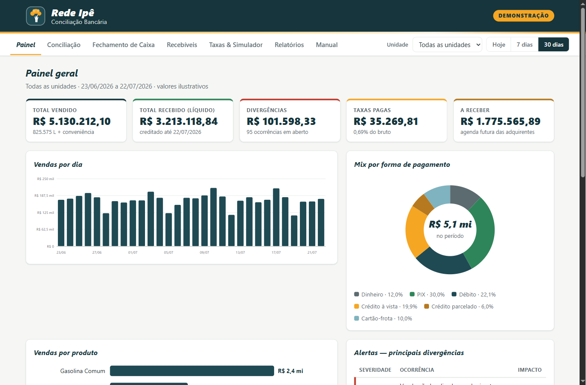

# Rede Ipê · Conciliação Bancária — Demonstração

> Protótipo de apresentação com **dados 100% fictícios**. Não é um sistema oficial da Rede Ipê.

**🌐 Acesse a demonstração:** <https://rafaelgsantos67.github.io/redeipe-conciliacao-demo/>



## O que é

Painel interativo que simula a rotina completa de **conciliação bancária de uma rede de postos de combustível**: do fechamento de caixa por turno ao cruzamento venda × recebível × extrato, passando pela conferência de taxas das adquirentes e pela agenda de recebíveis.

## Funcionalidades

- **Painel** — indicadores do período (vendido, recebido, divergências, taxas, a receber), gráficos de vendas por dia, mix por forma de pagamento e vendas por produto, além dos principais alertas de divergência.
- **Conciliação** — tabela venda × recebível com ordenação, busca, filtro por status e por **tipo de divergência**, e modal de detalhes com linha do tempo (venda → captura → liquidação) e os **lançamentos do extrato bancário** vinculados ao lote. Divergências dos 5 tipos reais do setor: taxa maior que a contratada, venda não localizada, chargeback, duplicidade e tarifa de POS não prevista.
- **Fechamento de Caixa** — encerrantes inicial/final por bomba, valor esperado × apurado, sangrias e quebra de caixa, com referência ao LMC e à Resolução ANP nº 884/2022.
- **Recebíveis** — agenda dos próximos 40 dias por adquirente e simulador de antecipação (por período e por adquirente).
- **Taxas & Simulador** — taxa contratada × taxa média cobrada por adquirente/modalidade e calculadora de recebimento.
- **Relatórios** — DRE simplificado do período, exportação CSV e impressão/PDF.
- **Manual de Padronização** — rotina diária em 6 etapas com checklist interativo, pensada como roteiro para vídeos de treinamento.

Os filtros globais de **unidade** e **período** atualizam todas as abas. No Painel, clicar em uma barra de "Vendas por dia" abre a conciliação daquele dia.

## Como executar

Não há dependências, servidor ou instalação:

1. **Online** — abra o [link da demonstração](https://rafaelgsantos67.github.io/redeipe-conciliacao-demo/); ou
2. **Local** — baixe o repositório e dê **duplo clique em `index.html`**.

## Tecnologia

- **HTML + CSS + JavaScript puros** — zero frameworks, zero CDN, zero build.
- Gráficos em **SVG gerado por JavaScript**.
- Dados simulados **determinísticos** (PRNG mulberry32 com seed fixa): os números são idênticos em qualquer recarregamento, com consistência contábil (bruto − taxa = líquido esperado).
- `localStorage` apenas para o estado da demonstração, com botão "Reiniciar demonstração".

```
index.html        interface (SPA com abas)
css/styles.css    identidade visual e layout
js/data.js        gerador de dados fictícios seedado
js/app.js         filtros, abas, gráficos e interações
```

---

Demonstração desenvolvida por **Rafael Guilherme dos Santos** · Campo Grande/MS · 2026
